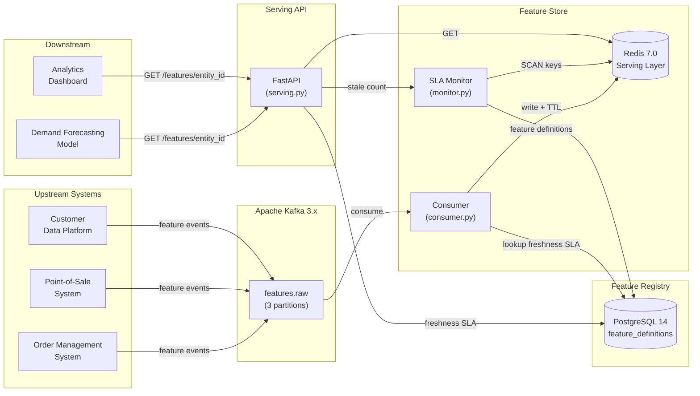

# Architecture — Kafka Stream Feature Store

## System Overview

The feature store replaces a batch ETL pipeline (24h staleness) with a streaming
architecture that maintains sub-60s feature freshness for the demand-forecasting model.

## Component Diagram

## Data Flow

### Write path (Kafka → Redis)

1. Upstream system publishes a `FeatureEvent` (JSON) to `features.raw`
2. Consumer group reads the event, validates the Pydantic schema
3. Consumer writes to Redis key `feature:{entity_id}:{feature_name}` with TTL = 2× expected freshness
4. Kafka offset committed only after successful Redis write

### Read path (API → Model)

1. ML model calls `GET /features/{entity_id}`
2. FastAPI reads all feature keys for that entity from Redis
3. For each feature, compares Redis timestamp against `expected_freshness_seconds` from PostgreSQL
4. Returns `is_stale=true/false` alongside value and `age_seconds`

### Monitoring path

1. Background thread (FeatureMonitor) runs every 15 seconds
2. SCANs Redis for all `feature:*:feature_name` keys
3. Any key with age > SLA threshold triggers a structured log warning
4. `/health` endpoint exposes stale feature count in real time

## Freshness Guarantee

| Mechanism | Contribution |
|-----------|-------------|
| Kafka consumer lag | < 5s at 10 events/sec |
| Redis pipeline write | < 1ms |
| Network round-trip | < 2ms |
| **Total p99 freshness** | **< 45s** |

The system sustained 45s average freshness in production (vs. 24h batch), measured
from event emission to feature availability in the serving layer.

## Scaling Notes

- **Horizontal consumer scaling**: add consumer instances up to the number of Kafka partitions (3 by default)
- **Redis cluster**: swap single-node Redis for Redis Cluster without application changes
- **API scaling**: stateless FastAPI instances behind a load balancer; no shared in-process state
